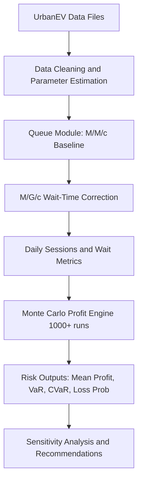
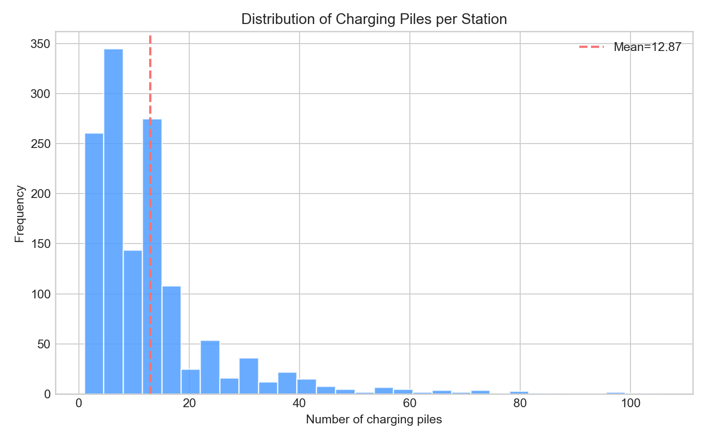
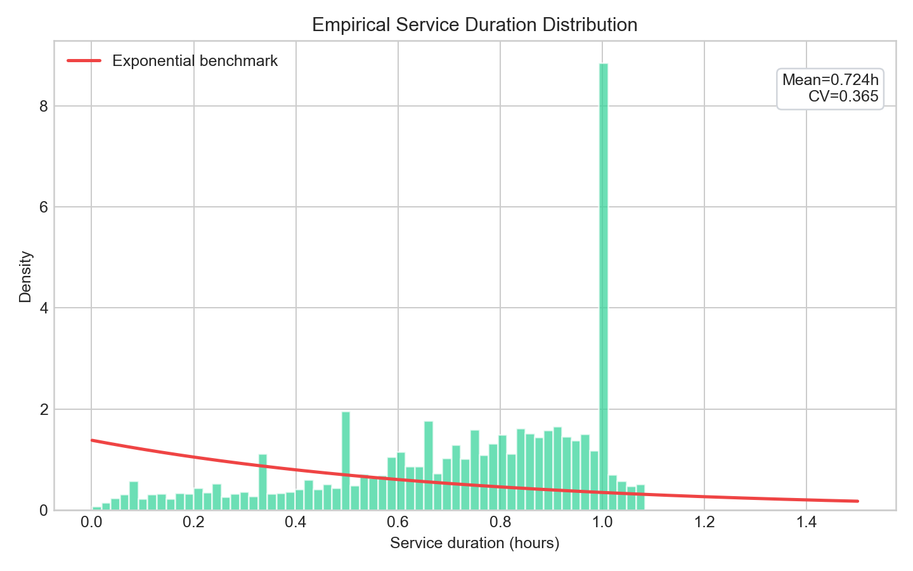
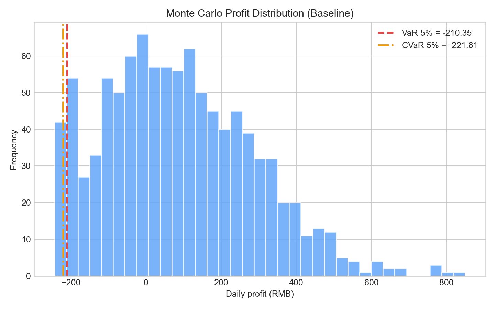
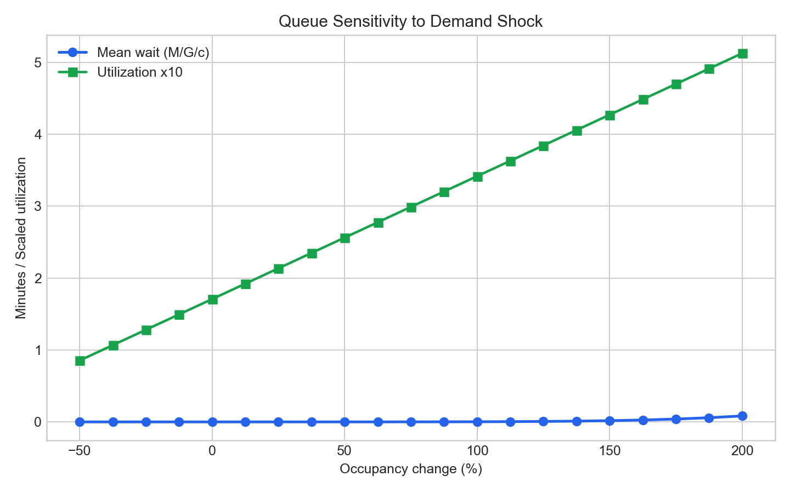
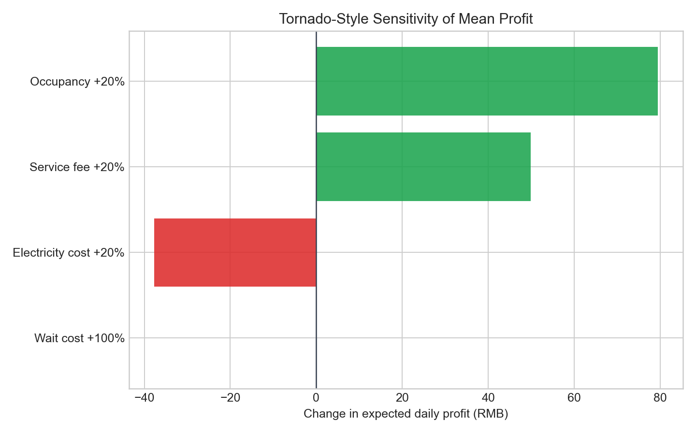
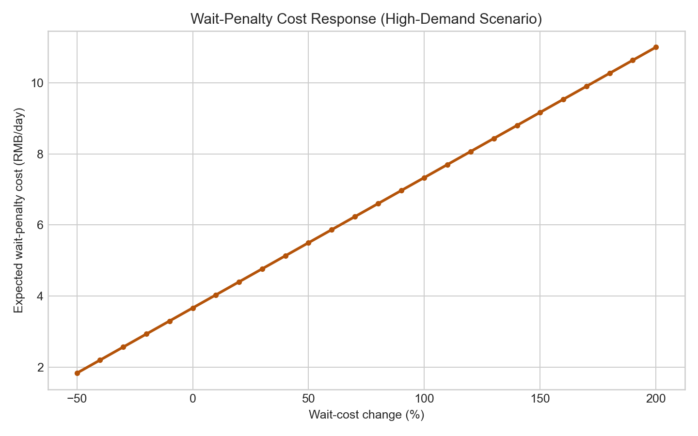

# BA3093 Simulation and Risk Analysis Group Project Report

## Cover Page

- Project Title: EV Charging Station Profit Risk Analysis with Monte Carlo and Queuing Simulation
- Group Number: Group [To Be Filled]
- Section Number: [To Be Filled]
- Course: BA3093 Simulation and Risk Analysis
- Submission Date: 24 May 2025
- Team Members:
  - [Name] ([Student ID])
  - [Name] ([Student ID])
  - [Name] ([Student ID])

---

## 1. Problem Introduction

This project studies a practical operational-financial question in public EV charging:

How does uncertainty in demand, service process, and pricing translate into daily profit risk, and what resource or pricing decisions should operators make?

The analysis combines both technical streams required by the course:

- Option A: Monte Carlo simulation for profit-risk quantification.
- Option B: Queuing analysis for waiting-system performance under demand uncertainty.

A simulation approach is appropriate because the system contains multiple uncertain inputs (arrivals, service durations, electricity prices, service-fee dynamics, and waiting-related cost). Closed-form deterministic budgeting cannot capture tail risk or nonlinear waiting effects. Therefore, we use Monte Carlo to estimate output distributions and queueing theory to model congestion mechanics and service performance (Gross et al., 2018; Glasserman, 2004).

---

## 2. Data and Parameters

### 2.1 Data Source

We use the UrbanEV Shenzhen public charging dataset (CC0), including 1,362 stations, 275 TAZs, and hourly records from 2022-09-01 to 2023-02-28.

Core files:

- inf.csv: station metadata (location, number of chargers).
- duration.csv: hourly cumulative charging duration by TAZ.
- occupancy.csv: hourly concurrent charging sessions by TAZ.
- volume-11kW.csv: hourly charging volume by TAZ.
- e_price.csv: electricity price by TAZ and hour.
- s_price.csv: service fee by TAZ and hour.

### 2.2 Parameter Estimation

Key parameters are estimated from data-processing pipelines in backend/data_processor.py.

| Parameter | Definition | Estimation Method | Baseline Value |
|---|---|---|---|
| $c$ | Number of servers (chargers/station) | Mean of charge_count | 13 |
| $\mu$ | Service rate (sessions/hour/pile) | $\mu = 1/\bar{W}$ | 1.3815 |
| $\lambda$ | Arrival rate (sessions/hour/station) | Little's Law from occupancy and duration | 3.0682 |
| $CV$ | Service-time coefficient of variation | $CV = \sigma_W / \bar{W}$ | 0.3650 |
| $\bar{Q}$ | Mean kWh/session | Derived from volume and occupancy | data-driven |
| $p_e, p_s$ | Electricity and service prices | Means and std from price files | data-driven |
| $p_w$ | Wholesale electricity cost | External benchmark | 0.55 RMB/kWh |
| $C_f$ | Daily fixed operating cost | External benchmark | 300 RMB/day |
| $c_{wait}$ | Wait-penalty unit cost | Management assumption | 0.20 RMB/(vehicle*min) |

Descriptive statistics table (auto-generated):

- report_assets/descriptive_statistics.csv

### 2.3 Assumption Justification

- Arrival process is modeled as Poisson at hourly aggregation level.
- Service times are not exponential ($CV=0.365<1$), so we keep M/M/c as baseline and apply M/G/c correction.
- FCFS discipline and effectively unbounded queue are practical approximations for public charging contexts.

---

## 3. Model Design

### 3.1 End-to-End Modelling Workflow

### 3.2 Queuing Model (Option B)

Baseline utilization:

$$
\rho = \frac{\lambda}{c\mu}, \quad \rho < 1
$$

Erlang-C waiting probability:

$$
P(\text{wait}) = \frac{\frac{(c\rho)^c}{c!}\cdot\frac{1}{1-\rho}}{\sum_{n=0}^{c-1}\frac{(c\rho)^n}{n!}+\frac{(c\rho)^c}{c!}\cdot\frac{1}{1-\rho}}
$$

M/M/c waiting time:

$$
W_q^{M/M/c} = \frac{P(\text{wait})}{c\mu(1-\rho)}
$$

M/G/c correction using empirical $CV$:

$$
W_q^{M/G/c} \approx W_q^{M/M/c}\times\frac{1+CV^2}{2}
$$

With $CV=0.365$:

$$
\text{correction factor}=\frac{1+0.365^2}{2}=0.5666
$$

### 3.3 Monte Carlo Risk Model (Option A)

At each simulation run $i$:

- Sessions: $N_i\sim\text{Poisson}(\lambda_{eff}\cdot 24)$
- kWh per session: $Q_i\sim\mathcal{N}(\mu_Q,\sigma_Q)$ with truncation
- Prices: $p_{e,i}, p_{s,i}$ sampled from empirical-normal perturbations
- Wholesale cost: $p_{w,i}$ with stochastic perturbation

Profit without waiting penalty:

$$
\Pi_i^{old}=N_iQ_i(p_{e,i}+p_{s,i})-N_iQ_ip_{w,i}-C_f
$$

Wait-penalty augmentation:

$$
\Pi_i^{new}=\Pi_i^{old}-N_i\cdot W_q^{M/G/c}\cdot c_{wait}
$$

Outputs from $n\ge 1000$ runs include:

- Expected profit $E[\Pi]$
- VaR at 5%
- CVaR at 5%
- Loss probability $P(\Pi<0)$

### 3.4 Reproducibility

Implementation modules:

- backend/data_processor.py
- backend/queuing_model.py
- backend/monte_carlo.py
- backend/main.py
- visualization.py (report figures)

---

## 4. Results and Analysis

### 4.1 Descriptive Statistics

Interpretation:

- Charger count is heterogeneous, implying location-level capacity imbalance.
- Service-duration empirical shape is much more concentrated than exponential, supporting M/G/c correction.

### 4.2 Profit-Risk Distribution

Interpretation:

- Profit risk is asymmetric: downside tail exists even when mean profit is positive.
- VaR and CVaR provide managerially relevant downside metrics for daily cash-flow risk tolerance.

### 4.3 Queuing Performance Under Demand Shock

Interpretation:

- Waiting time rises nonlinearly as utilization increases.
- Small demand increases near moderate-to-high utilization can generate disproportionate waiting escalation.

### 4.4 Business Meaning

The integrated model links operations and finance: congestion is not just a service KPI; it directly affects profit through wait-penalty and potential user dissatisfaction costs.

---

## 5. Sensitivity Analysis

### 5.1 Tornado-Style Input Impact on Expected Profit

Main findings:

- Occupancy and service fee are major upside/downside drivers.
- Electricity cost shocks materially compress margin.
- Wait-cost shocks have stronger effect under high-demand regimes than under uncongested regimes.

### 5.2 Wait-Cost Response Curve

Interpretation:

- Under high demand, increasing wait-penalty unit cost creates near-linear expected penalty growth.
- This validates the managerial importance of queue mitigation when demand surges.

---

## 6. Conclusion and Recommendations

### 6.1 Conclusion

This project satisfies both BA3093 technical streams:

- Monte Carlo simulation quantifies distributional profit risk and tail metrics.
- Queuing model quantifies operational waiting risk and links it to financial outcomes.

The M/M/c baseline plus M/G/c correction improves realism while retaining analytical transparency.

### 6.2 Actionable Recommendations

1. Peak-hour capacity policy: add temporary charging capacity or dynamic slot allocation when utilization approaches threshold levels.
2. Pricing policy: apply moderate service-fee differentiation by congestion level to protect margins while smoothing demand.
3. Queue-risk governance: track wait-penalty indicators in daily operations dashboard and trigger mitigation actions when threshold is exceeded.

### 6.3 Limitations and Extensions

- Hourly aggregated data does not include exact timestamp-level arrivals and service completion records.
- Future work can adopt event-level logs and discrete-event simulation for finer queue dynamics.
- Scenario optimization can be extended to multi-station portfolio decisions and robust scheduling.

---

## References (APA Style)

Glasserman, P. (2004). Monte Carlo methods in financial engineering. Springer.

Gross, D., Shortle, J. F., Thompson, J. M., & Harris, C. M. (2018). Fundamentals of queueing theory (5th ed.). Wiley.

Hopp, W. J., & Spearman, M. L. (2011). Factory physics (3rd ed.). Waveland Press.

Mao, H., Feng, Y., Wu, J., et al. (2024). UrbanEV: A multi-source dataset for public charging operations in Shenzhen. Scientific Data.

Shenzhen Municipal Development and Reform Commission. (2023). Industrial and commercial electricity tariff notice.

---

## Appendix (Optional)

- A1: Source code files in backend and frontend folders.
- A2: Generated figure assets in report_assets.
- A3: Reproducible notebook: BA3093_Project_Demo.ipynb.
