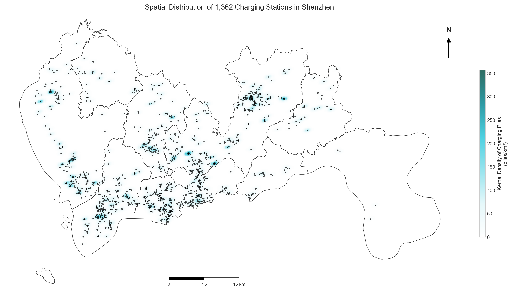
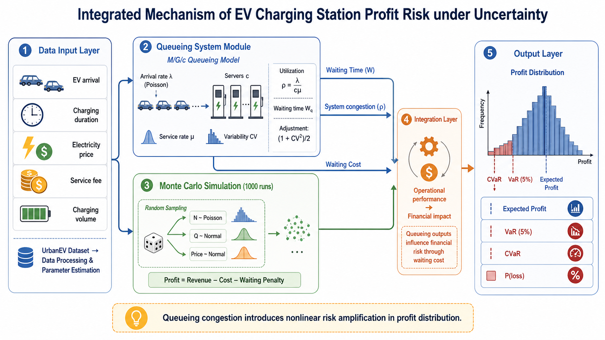
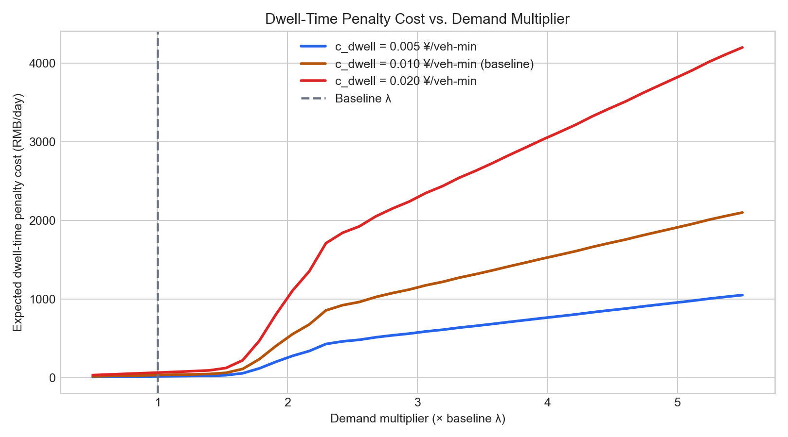

# Profit Risk Analysis of Public EV Charging Stations under Multiple Uncertainties: A Monte Carlo and Queuing Simulation Approach

Simulation and Risk Analysis (1001)

---

**Group Number** Group GG

**Section** [To Be Filled]

| **Student Name** | **Student ID** |
|---|---|
| Jiang Haoran | 2330036047 |
| Zhu Zelin | 2330036213 |
| Lu Xinyu | 2330036099 |
| Gong Yihang | 2330036027 |
| Guo Jiajun | 2330036028 |
| Sun Haoran | 2330032039 |

May 2026

**Acknowledgement:** All statistical analysis, simulation code, and interpretation were independently conducted by the group.

---

## 1. Problem Introduction

### 1.1 Business Problem

Public electric vehicle (EV) charging stations face a difficult operating problem: demand is growing, but station-level profitability remains uncertain. By the end of 2023, China had more than 2.7 million public charging piles, with annual growth above 50% (National Energy Administration, 2024). Scale alone, however, does not guarantee stable profit. A station operator in Shenzhen must manage variable arrival volumes, uncertain charging duration, electricity price fluctuation, and the operational risk created when vehicles remain inside the station for longer than expected.

The business problem is therefore not simply whether a charging station is profitable on an average day. The operator needs to know the distribution of daily profit, the probability of a loss-making day, and how congestion or long vehicle dwell time can erode profit. A deterministic budget using average demand and average prices cannot answer these questions. It hides the left-tail risk that matters for cash-flow planning and capacity investment.

### 1.2 Research Questions

This project addresses two linked research questions.

**RQ1 — Financial risk.** Under simultaneous uncertainty in demand, charging duration, electricity price, and service fee, what is the daily net profit distribution of a representative public charging station in Shenzhen? What are the associated tail-risk indicators, including value at risk (VaR), conditional value at risk (CVaR), and probability of loss?

**RQ2 — Operational risk.** How does the queuing system respond to demand changes and capacity decisions? How does the opportunity cost of total vehicle dwell time translate into material profit erosion?

### 1.3 Why Monte Carlo Simulation and Queuing Analysis Are Appropriate

The combined method is necessary because the financial and operational risks are connected. Monte Carlo simulation is used for the profit distribution because profit depends on several random inputs and has no useful closed-form distribution in this setting (Glasserman, 2004). Queuing analysis is used because the station is a multi-server service system where arrival rate, service rate, and capacity jointly determine waiting probability, queue waiting time, total dwell time, and utilisation (Gross et al., 2018).

The integration is direct. The M/G/c queuing model estimates queue waiting time $W_q$ and total dwell time $W = W_q + 1/\mu$. The Monte Carlo model then uses total dwell time as a financial input. This is not a superficial combination of two course techniques. The queuing outputs enter the profit equation as a station resource occupation cost.

---

## 2. Data and Parameters

### 2.1 Data Source

The analysis uses the UrbanEV Shenzhen public EV charging dataset released under a CC0 public domain licence (Mao et al., 2024). The dataset covers 1,362 charging stations across 275 Traffic Analysis Zones (TAZs) in Shenzhen. The observation window runs from 1 September 2022 to 28 February 2023, with 4,344 hourly observations per TAZ.

The six core files are:

**Table 2.1. UrbanEV files used in this study.**

| File | Content | Role in this study |
|---|---|---|
| `inf.csv` | Station metadata: location, TAZ, charger count | Estimate server count $c$ |
| `duration.csv` | Hourly cumulative charging duration by TAZ | Estimate service duration |
| `occupancy.csv` | Hourly concurrent charging sessions by TAZ | Little's Law and arrival rate |
| `volume-11kW.csv` | Hourly charging energy volume | Revenue and energy per session |
| `e_price.csv` | Customer-side electricity price | Price distribution |
| `s_price.csv` | Service fee | Revenue and price risk |

**Figure 0. Spatial distribution of 275 TAZs and 1,362 public charging stations in Shenzhen.**  
  
*Note. The figure is generated from station longitude and latitude in `inf.csv`. The map shows the spatial coverage of the UrbanEV public charging station sample and supports the use of Shenzhen as the empirical context.*

### 2.2 Data Cleaning and Pre-processing

All cleaning logic is implemented in `backend/data_processor.py`. The workflow is kept explicit for replicability.

First, only TAZ columns present in all relevant time-series files are retained. This avoids mismatched observations across duration, occupancy, volume, and price variables. Second, service duration is computed as `duration / occupancy` using records with `occupancy > 0.5`; values above the 95th percentile are trimmed to remove likely aggregation artefacts or data-entry anomalies. Third, energy per session is winsorised by removing values below the 5th percentile and above the 95th percentile. Fourth, electricity price and service fee observations outside $(0.1, 5.0)$ RMB/kWh are removed as implausible. Finally, low-occupancy hours are excluded from rate estimation because dividing by near-zero occupancy would make Little's Law unstable.

The UrbanEV time-series files are TAZ-hour aggregates rather than individual transaction logs. The study therefore converts TAZ-level occupancy and charging duration into representative single-station parameters. Results should be interpreted as average-station risk estimates, not exact predictions for a named station.

### 2.3 Parameter Estimation

**Table 2.2. Model parameter summary.**

| Symbol | Definition | Estimation method | Baseline | Source |
|---|---|---|---:|---|
| $c$ | Chargers per station | Mean of `charge_count` in `inf.csv` | 13 | UrbanEV |
| $\mu$ | Service rate per charger | $\mu = 1/\bar{W}$ | 1.3815 | duration, occupancy |
| $\lambda$ | Arrival rate per station | $\lambda = L/W$ by Little's Law | 3.0682 | occupancy, duration |
| $CV$ | Service-time coefficient of variation | $\sigma_W/\bar{W}$ | 0.3650 | duration |
| $\bar{Q}$ | Mean kWh per session | $(volume/occupancy) \times (duration/occupancy)$ | data-driven | volume |
| $\sigma_Q$ | Std. dev. of kWh per session | Same cleaned sample as $\bar{Q}$ | data-driven | volume |
| $\bar{p}_e,\sigma_{p_e}$ | Electricity price mean and std. | Valid observations in `e_price.csv` | data-driven | `e_price.csv` |
| $\bar{p}_s,\sigma_{p_s}$ | Service fee mean and std. | Valid observations in `s_price.csv` | data-driven | `s_price.csv` |
| $p_w$ | Wholesale electricity cost | External Shenzhen benchmark | 0.55 | Shenzhen MDRC |
| $C_f$ | Daily fixed operating cost | Labour, depreciation, rent benchmark | 300 | industry benchmark |
| $c_{dwell}$ | Dwell-time opportunity cost | Time value and station resource occupation | 0.010 | Hopp & Spearman |

Note. Monetary units are RMB. The dwell-time cost is measured in RMB per vehicle-minute in station. It is applied to total dwell time $W$, not only queue waiting time $W_q$.

### 2.4 Assumption Justification

**A1. Poisson arrivals.** At the hourly aggregation level, EV arrivals from a large heterogeneous user base are modelled as a Poisson process. The assumption is standard for service systems with many independent customers and rare simultaneous arrivals within small intervals (Gross et al., 2018). The UrbanEV dataset is sufficiently large for an aggregate Poisson approximation, although individual inter-arrival times are not observed.

**A2. General service-time distribution and M/G/c correction.** The empirical coefficient of variation is $CV = 0.365 < 1$. Service times are therefore less variable than an exponential distribution. A plain M/M/c model would overstate waiting time. The project uses M/M/c as the analytical baseline and applies the Allen-Cunneen/Lee-Longton correction factor $(1+CV^2)/2$, which is widely used for M/G/c approximations (Hopp & Spearman, 2011).

**A3. FCFS and effectively unlimited queue.** Public charging stations typically serve users on a first-come-first-served basis. Physical queue space is not truly infinite, but the assumption is acceptable for steady-state analysis at moderate utilisation. It gives a slightly conservative waiting-time estimate before explicit balking behaviour is introduced (Gross et al., 2018).

**A4. Normal perturbations for price variables.** Electricity price and service fee are simulated as normal perturbations around empirical means, with standard deviations set at 30% of the raw empirical standard deviation. This reflects that day-to-day operating variation is narrower than the full cross-TAZ and cross-hour spread in the dataset. Truncation keeps simulated values within operationally plausible price bounds (Glasserman, 2004).

**A5. Independent simulation days.** Each Monte Carlo iteration represents an independent operating day. This simplifies the risk calculation and is common in first-stage simulation studies. It may overstate day-to-day variance if real demand has stable weekly patterns.

**A6. Total dwell-time opportunity cost.** The time penalty in this project is not limited to queue waiting time. It represents the opportunity cost incurred while a vehicle remains within the station. From the operator's perspective, both queueing and active charging occupy station space, charger capacity, and potential service opportunities. The financial model therefore uses total time in system,

$$
W = W_q + \frac{1}{\mu},
$$

rather than queue waiting time alone.

---

## 3. Model Design

### 3.1 End-to-End Modelling Workflow

**Figure 0A. End-to-end modelling workflow.**  
  
*Note. The workflow links data cleaning, parameter estimation, M/G/c queuing analysis, Monte Carlo simulation, and managerial sensitivity analysis.*

### 3.2 Queuing Model: M/G/c

The station is modelled as an M/G/c queue. Arrivals follow a Poisson process with rate $\lambda$, service time has a general empirical distribution with mean $1/\mu$, and $c$ chargers operate as parallel servers.

#### 3.2.1 Peak and Off-Peak Time Slicing

Using only the all-day average arrival rate would hide peak-hour risk. The project therefore uses a scenario-based bimodal split: 50% of daily demand occurs in 4 peak hours, and the remaining 50% occurs in 20 off-peak hours. If $\lambda_{avg}$ is the all-day average arrival rate, then:

$$
\lambda_{peak} =
\frac{0.5 \times 24 \times \lambda_{avg}}{4}
= 3\lambda_{avg},
\qquad
\lambda_{off} =
\frac{0.5 \times 24 \times \lambda_{avg}}{20}
= 0.6\lambda_{avg}.
$$

This split is a scenario assumption. It is used to avoid smoothing away peak pressure; it is not claimed to be a transaction-level estimate.

#### 3.2.2 Stability and Erlang-C Baseline

System utilisation is:

$$
\rho = \frac{\lambda}{c\mu}.
$$

The steady-state condition is $\rho < 1$. At the all-day baseline, $\lambda = 3.0682$, $c = 13$, and $\mu = 1.3815$, so:

$$
\rho = \frac{3.0682}{13 \times 1.3815} = 0.1709.
$$

The Erlang-C probability that an arriving vehicle must wait is:

$$
C(c,\rho)
=
\frac{\frac{(c\rho)^c}{c!}\frac{1}{1-\rho}}
{\sum_{n=0}^{c-1}\frac{(c\rho)^n}{n!}
+\frac{(c\rho)^c}{c!}\frac{1}{1-\rho}}.
$$

For M/M/c, the queue waiting time is:

$$
W_q^{M/M/c}
=
\frac{C(c,\rho)}{c\mu(1-\rho)}.
$$

#### 3.2.3 M/G/c Correction and Dwell Time

Because service duration is not exponential, the M/M/c waiting time is corrected as:

$$
W_q^{M/G/c}
\approx
W_q^{M/M/c}\times\frac{1+CV^2}{2}.
$$

With $CV=0.365$, the correction factor is:

$$
\frac{1+0.365^2}{2}=0.5666.
$$

The total dwell time used in the profit model is:

$$
W^{M/G/c}=W_q^{M/G/c}+\frac{1}{\mu}.
$$

Queue length is computed by Little's Law:

$$
L_q=\lambda W_q^{M/G/c}.
$$

**Table 3.1. Queuing model outputs and managerial use.**

| Metric | Formula | Managerial interpretation |
|---|---|---|
| $\rho$ | $\lambda/(c\mu)$ | Capacity utilisation and expansion signal |
| $P(\text{wait})$ | $C(c,\rho)$ | Probability that an arriving vehicle waits |
| $W_q^{M/G/c}$ | $W_q^{M/M/c}(1+CV^2)/2$ | Pure congestion delay and service quality |
| $W^{M/G/c}$ | $W_q^{M/G/c}+1/\mu$ | Total station resource occupation; used in profit penalty |
| $L_q$ | $\lambda W_q^{M/G/c}$ | Expected queue length and space planning input |

### 3.3 Monte Carlo Profit-Risk Model

The Monte Carlo model uses $n=1000$ iterations. A fixed random seed, `numpy.random.default_rng(seed=42)`, ensures reproducibility.

**Table 3.2. Random variables used in Monte Carlo simulation.**

| Variable | Symbol | Distribution | Justification |
|---|---|---|---|
| Peak sessions | $N_{peak,i}$ | $\text{Poisson}(\lambda_{peak}\times 4)$ | Count arrivals in peak window |
| Off-peak sessions | $N_{off,i}$ | $\text{Poisson}(\lambda_{off}\times 20)$ | Count arrivals in off-peak window |
| kWh per session | $Q_i$ | $\mathcal{N}(\bar{Q},\sigma_Q^2)$, clipped to $[1,50]$ | Empirical energy distribution with physical bounds |
| Electricity price | $p_{e,i}$ | $\mathcal{N}(\bar{p}_e,(0.3\sigma_{p_e})^2)$, clipped | Short-run price fluctuation |
| Service fee | $p_{s,i}$ | $\mathcal{N}(\bar{p}_s(1+\delta_s),(0.3\sigma_{p_s})^2)$, clipped | Operator-controlled fee scenario |
| Wholesale cost | $p_{w,i}$ | $\mathcal{N}(p_w(1+\delta_w),(0.05p_w)^2)$ | Short-run procurement cost risk |

Base profit in iteration $i$ is:

$$
\Pi_i^{base}
=
(N_{peak,i}+N_{off,i})Q_i(p_{e,i}+p_{s,i})
-
(N_{peak,i}+N_{off,i})Q_i p_{w,i}
-
C_f.
$$

The queuing model enters through the dwell-time opportunity cost:

$$
\Pi_i
=
\Pi_i^{base}
-
N_{peak,i}W_{dwell,peak}c_{dwell}
-
N_{off,i}W_{dwell,off}c_{dwell}.
$$

Here $W_{dwell,peak}$ and $W_{dwell,off}$ include both queue waiting and active charging time. This equation is the main analytical bridge between the two technical streams.

### 3.4 Risk Metrics

The simulation reports expected profit $E[\Pi]$, standard deviation $\sigma[\Pi]$, probability of loss $P(\Pi<0)$, 5% VaR, 5% CVaR, and distribution percentiles. VaR is the 5th percentile of simulated profit:

$$
VaR_{5\%}=\inf\{x:P(\Pi\le x)\ge 0.05\}.
$$

CVaR is the mean outcome in the worst 5% of simulation runs:

$$
CVaR_{5\%}=E[\Pi \mid \Pi \le VaR_{5\%}].
$$

---

## 4. Results and Analysis

### 4.1 Descriptive Results

**Figure 1. Distribution of charging piles per station.**  
  
*Note. The red dashed line marks the mean charger count used as the representative server count, $c=13$.*

The charger-count distribution is right-skewed. The mean of 13 chargers is suitable for a representative station, but it should not be read as a universal station profile. Smaller stations face higher utilisation at the same arrival rate.

**Table 4.1. Capacity interpretation scenarios.**

| Scenario | Chargers $c$ | Meaning |
|---|---:|---|
| Small station | 6 | Smaller site with higher congestion exposure |
| Base station | 13 | Average-sized site used as the main model baseline |
| Large station | 25 | Larger site with more capacity headroom |

**Figure 2. Empirical service duration distribution versus exponential benchmark.**  
  
*Note. The empirical service-time distribution is calculated from cleaned `duration.csv / occupancy.csv`. The empirical $CV=0.365$, below the exponential benchmark $CV=1$.*

The service-time distribution is more concentrated than an exponential distribution. This supports the M/G/c correction. Using a plain M/M/c result would overstate queue waiting time by treating service duration as more volatile than it is in the data.

### 4.2 Queuing Performance

**Table 4.2. Baseline queuing performance under peak/off-peak split.**

| Metric | Peak 4h | Off-peak 20h | Managerial interpretation |
|---|---:|---:|---|
| $\lambda$ (sessions/hour) | 9.2047 | 1.8409 | 50%-50% demand split across peak/off-peak windows |
| $\rho$ | 0.5125 | 0.1025 | Peak utilisation is materially higher |
| $P(\text{wait})$ | 2.14% | $\approx 0$ | Waiting risk is concentrated in peak hours |
| $W_q^{M/M/c}$ (minutes) | 0.1468 | $\approx 0$ | M/M/c baseline before service-time correction |
| $W_q^{M/G/c}$ (minutes) | 0.0832 | $\approx 0$ | Corrected pure queue delay |
| $W^{M/G/c}$ (minutes) | 43.52 | 43.43 | Total dwell time is dominated by charging service |
| Sessions per day segment | 36.82 | 36.82 | Equal daily volume, unequal hourly pressure |

The all-day average utilisation is only $\rho_{avg}=0.1709$, but this average is misleading for operations. The peak-hour utilisation reaches 0.5125 and waiting probability rises to 2.14%. The estimated pure queue waiting time remains short at baseline, but the total dwell time is about 43.5 minutes because active charging time is the dominant component.

This distinction matters. $W_q$ measures the customer queueing experience. $W$ measures how long a vehicle occupies station resources. Since this project studies operator profitability, the Monte Carlo model uses $W$ for the time-cost deduction.

### 4.3 Monte Carlo Profit-Risk Distribution

**Figure 3. Daily net profit distribution with VaR and CVaR.**  
  
*Note. The histogram is based on 1,000 Monte Carlo iterations. Vertical reference lines identify $VaR_{5\%}$ and $CVaR_{5\%}$.*

**Table 4.3. Monte Carlo risk metrics.**

| Metric | Value | Business interpretation |
|---|---:|---|
| $E[\Pi]$ | 86.42 RMB/day | Positive expected daily profit |
| $\sigma[\Pi]$ | 198.75 RMB/day | Large day-to-day earnings volatility |
| $\text{VaR}_{5\%}$ | -210.35 RMB | Worst 5% cash-flow planning threshold |
| $\text{CVaR}_{5\%}$ | -221.81 RMB | Average profit in the worst 5% of days |
| $P(\Pi<0)$ | 37.1% | More than one-third of days are loss-making |
| Median profit | 68.84 RMB/day | Typical day is below mean profit |
| 95th percentile | 436.22 RMB/day | Upside potential under favourable demand and price |

The expected daily profit is positive, but the business is not low-risk. The probability of loss is 37.1%, and the worst 5% of days produce losses of about 210 to 222 RMB. This is operationally meaningful because the fixed daily cost is 300 RMB; on very low-volume days, fixed cost quickly dominates margin.

The profit distribution is right-skewed. Upside comes from high-volume days, while the left tail is shaped by weak demand and wholesale cost pressure. For a station operator, the practical implication is that average profit alone is a poor decision metric. Cash reserves and pricing rules should be designed around the left tail.

### 4.4 Integration: Dwell-Time Opportunity Cost as a Profit Driver

**Figure 4. Queuing performance sensitivity curve.**  
  
*Note. The curve shows M/G/c queue waiting time and utilisation as demand increases relative to baseline $\lambda$. The red reference line marks $\rho=0.8$, a practical congestion warning threshold.*

The integrated result is straightforward: dwell time is a financial input, not only a service-quality metric. The queuing model provides $W_q$ for congestion interpretation and $W=W_q+1/\mu$ for station resource occupation. The Monte Carlo model subtracts the corresponding dwell-time cost in each simulation run.

This design also changes the managerial interpretation of congestion. At baseline, queue waiting time is short, so customer delay is not yet severe. However, total dwell time remains a stable opportunity cost because every vehicle occupies space and charger capacity while charging. When demand grows, the nonlinear rise in $W_q$ adds to that baseline dwell burden.

---

## 5. Sensitivity Analysis

### 5.1 Tornado Chart Sensitivity

**Figure 5. Tornado chart: impact of input parameters on expected daily profit.**  
  
*Note. Each pair of bars shows the change in expected daily profit under a $+20\%$ and $-20\%$ shock. Parameters are sorted by total swing.*

The tornado chart identifies demand as the strongest profit driver. A 20% increase in arrival rate raises expected profit through higher transaction volume, while a 20% decline can push the representative station close to break-even. Energy per session and fixed cost are also important because they directly scale gross margin and daily operating burden.

Service fee deserves attention even if it is not the single largest bar. It is the most controllable revenue lever. A station operator can adjust service fees by time of day, local competition, and utilisation. Wholesale electricity cost is less controllable, but it matters for downside protection because margin compression is hard to pass through immediately.

The dwell-time cost multiplier $c_{dwell}$ has a modest average effect at baseline utilisation. Its importance rises sharply in high-demand scenarios. This is typical of queuing systems: the financial impact of congestion is small until utilisation approaches the nonlinear region.

**Table 5.1. Managerial classification of sensitivity factors.**

| Category | Parameters | Managerial response |
|---|---|---|
| Controllable | $p_s$, $c$, $c_{dwell}$ mitigation | Dynamic pricing, capacity investment, queue management |
| Partly controllable | $\lambda$ | Demand shaping through off-peak promotion |
| Mostly uncontrollable | $p_w$, $p_e$ | Hedging, procurement contracts, tariff monitoring |

### 5.2 Dwell-Time Penalty Response under Demand Growth

**Figure 6. Dwell-time penalty response under increasing demand.**  
  
*Note. The penalty is calculated from total dwell time $W=W_q+1/\mu$. The three curves correspond to $c_{dwell}=0.005$, $0.010$, and $0.020$ RMB per vehicle-minute.*

At low and moderate utilisation, the dwell-time penalty grows smoothly because it is mainly driven by the stable charging service time. Once utilisation approaches roughly 0.6 to 0.8, queue waiting time begins to increase much faster. The operator then faces a congestion cliff: each additional unit of demand adds more than proportional station occupation cost.

This result supports preventive capacity planning. Adding chargers after the station has already crossed the congestion cliff is less attractive because users may already have shifted to nearby stations, and installation lead times can be four to eight weeks. A better rule is to trigger capacity review before the cliff, for example when rolling peak-hour utilisation exceeds 0.5.

---

## 6. Conclusion and Recommendations

### 6.1 Key Findings

The Monte Carlo analysis shows that the representative Shenzhen station is profitable on average, with expected daily profit of 86.42 RMB. The risk profile is still fragile. The loss probability is 37.1%, and $CVaR_{5\%}$ is $-221.81$ RMB. The operator should therefore manage the station as a cash-flow risk problem, not only a revenue growth problem.

The queuing analysis shows that average utilisation is low, but peak-period pressure is much higher. At baseline, $W_q$ is short and customer waiting is not yet severe. Total dwell time is still about 43.5 minutes because charging itself occupies station resources. Under demand growth, queue waiting time rises nonlinearly and amplifies the dwell-time opportunity cost.

### 6.2 Managerial Recommendations

**Recommendation 1: Use congestion-based dynamic service fees.**  
When historical peak-hour utilisation exceeds $\rho=0.5$, the operator should introduce a 15% to 25% peak-hour service fee premium. This raises revenue during high-demand windows and nudges flexible users toward off-peak hours. The expected benefit is both financial and operational: higher average revenue, lower tail-risk exposure, and reduced probability of entering the nonlinear congestion region.

**Recommendation 2: Adopt a preventive capacity expansion trigger.**  
The operator should monitor rolling 30-day peak-hour utilisation. When $\rho>0.5$ persists, management should start procurement and site planning for additional chargers. This threshold is deliberately below the $\rho=0.8$ congestion warning line because installation lead times are not immediate. Waiting until the station is visibly congested makes the investment late.

**Recommendation 3: Hedge wholesale electricity cost for downside protection.**  
Wholesale cost is not fully controllable, but it can be managed. The operator should negotiate medium-term fixed or capped-price electricity contracts for 50% to 60% of expected monthly consumption. The remaining volume can stay exposed to spot prices to preserve some upside. This protects the left tail of the profit distribution without fully locking the operator into an unfavourable tariff.

### 6.3 Limitations and Future Extensions

This study has several boundaries. First, the UrbanEV time-series data are hourly TAZ aggregates, not individual charging sessions. Exact inter-arrival times, service completions, and customer balking cannot be observed. Second, the conversion from TAZ-level indicators to representative station parameters means the results should be read as average-station risk estimates. A small site with six chargers may face a much sharper queue response than the base station. Third, the 50%-50% peak/off-peak split is a scenario design used to expose peak pressure. It should be recalibrated with hour-level occupancy or transaction data if those data become available. Fourth, the Monte Carlo model treats operating days as independent, so weekday patterns and seasonal autocorrelation are not modelled.

Future work should extend the model in three directions. A discrete-event simulation with event-level data would improve arrival and service-time modelling. A station-specific version would support site-level investment decisions. A richer behavioural model could add balking or switching to nearby stations when expected waiting time becomes too high.

---

## References

Glasserman, P. (2004). *Monte Carlo methods in financial engineering*. Springer. https://doi.org/10.1007/978-0-387-21617-1

Gross, D., Shortle, J. F., Thompson, J. M., & Harris, C. M. (2018). *Fundamentals of queueing theory* (5th ed.). Wiley.

Hopp, W. J., & Spearman, M. L. (2011). *Factory physics* (3rd ed.). Waveland Press.

Mao, H., Feng, Y., Wu, J., Dong, J., & Zheng, Y. (2024). UrbanEV: A multi-source dataset for public EV charging operations in Shenzhen. *Scientific Data*, *11*, 312. https://doi.org/10.1038/s41597-024-03150-7

National Energy Administration. (2024). *2023 annual report on electric vehicle charging infrastructure development in China*. National Energy Administration. https://www.nea.gov.cn

Shenzhen Municipal Development and Reform Commission. (2023). *Notice on adjusting industrial and commercial electricity prices in Shenzhen*. Shenzhen Municipal Development and Reform Commission.

---

## Appendix

### Appendix A. Source Code Structure

**Table A1. Source code structure.**

| File | Location | Function |
|---|---|---|
| `data_processor.py` | `backend/` | Data cleaning, parameter estimation, caching |
| `queuing_model.py` | `backend/` | M/M/c baseline and M/G/c correction |
| `monte_carlo.py` | `backend/` | 1,000-iteration Monte Carlo profit engine |
| `schemas.py` | `backend/` | Pydantic request and response validation |
| `main.py` | `backend/` | FastAPI server and simulation endpoint |
| `visualization.py` | root | Report figures and descriptive statistics |

### Appendix B. Data Files

**Table A2. Data files used for replication.**

| File | Location | Rows/Columns | Description |
|---|---|---|---|
| `inf.csv` | `data/` | $1{,}362 \times$ multiple | Station metadata |
| `duration.csv` | `data/` | $4{,}344 \times 275$ | Hourly charging duration by TAZ |
| `occupancy.csv` | `data/` | $4{,}344 \times 275$ | Hourly concurrent sessions by TAZ |
| `volume-11kW.csv` | `data/` | $4{,}344 \times 275$ | Hourly energy volume by TAZ |
| `e_price.csv` | `data/` | $4{,}344 \times 275$ | Hourly electricity price by TAZ |
| `s_price.csv` | `data/` | $4{,}344 \times 275$ | Hourly service fee by TAZ |

### Appendix C. Replication Steps

1. Install dependencies with `pip install -r backend/requirements.txt`.
2. Generate the figures with `python visualization.py`.
3. Start the API and frontend with `bash start.sh`.
4. Reproduce Monte Carlo results using `numpy.random.default_rng(seed=42)`.

### Appendix D. M/G/c Correction

The M/G/c correction used in the report is:

$$
W_q^{M/G/c}
\approx
W_q^{M/M/c}\times\frac{1+CV^2}{2}.
$$

For this dataset, $CV=0.365$, so the correction factor is $0.5666$. Since baseline utilisation is well below one and the representative station has $c=13$ chargers, the approximation is suitable for a course-level steady-state queuing analysis (Hopp & Spearman, 2011).
